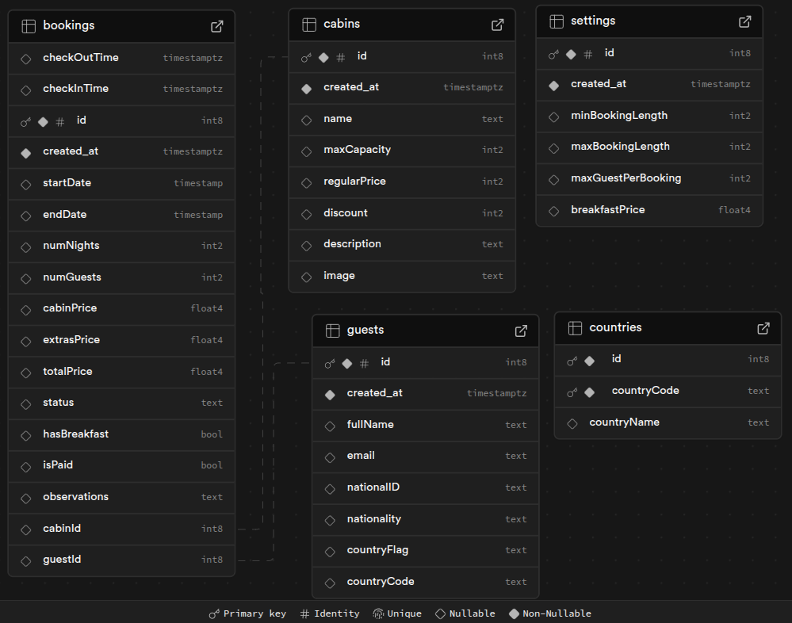

# Hotel Management App

## 📝 Project Overview

This is a **Hotel Management Application** designed for hotel employees to manage cabins, bookings, and guest data efficiently. The app ensures secure access and offers features like user authentication, booking management, statistics, and dark mode.

## 📝 Note

The core functionality of this project was developed during the course by following the instructor's instructions, including authentication, cabin management, viewing bookings, dashboard, settings, and user management.
**Additional features have been implemented by me as challenges.**

## 🛠️ Tech Stack

- **Frontend:** React, React Query
- **Backend & Database:** Supabase
- **UI Styling:** Tailwind CSS (or any CSS framework used)

## 🎯 Features

### Authentication

- Users must be logged in to access the application.
- New users can only sign up within the application (to ensure only hotel employees get accounts).
- Users can update their avatar, name, and password.

### Cabin Management

- **View a table with all cabins, displaying:**
  - Cabin photo
  - Name
  - Capacity
  - Price
  - Current discount
- **Add new cabins (with photo upload), update, and delete cabins.**

### Booking Management

- **View a table of all bookings, displaying:**
  - Arrival & departure dates
  - Booking status ("unconfirmed", "checked in", "checked out")
  - Paid amount
  - Guest and cabin details
- **Filter bookings based on status.**
- **Manage bookings:**
  - Delete bookings
  - Check guests in or out
  - Accept payment confirmation upon check-in
  - Add breakfast for guests upon check-in (if not pre-selected)
- **Additional Features Implemented:**
  - Create new bookings
  - Edit bookings
  - Bookings can be created based on minimum and maximum nights 

### Guest Management

- **Guest details include:**
  - Full name
  - Email
  - National ID
  - Nationality (with a country flag for easy identification)
- **Additional Features Implemented:**
  - A dedicated Guest Tab where employees can:
    - View registered guests
    - Create and remove guests
    - Edit guest details
    - Search for guests
    - View guest booking history
    - Check the current status of guests

### Dashboard

- Overview of key metrics for the last **7, 30, or 90 days**:
  - List of guests checking in and out on the current day (with quick actions)
  - Statistics on recent bookings, sales, check-ins, and occupancy rate
  - Daily hotel sales chart (total sales & extra sales like breakfast)
  - Stay duration statistics chart

### Application Settings

- Configurable settings for:
  - Breakfast price
  - Minimum & maximum nights per booking
  - Maximum guests per booking

### Additional Features

- **Dark Mode**: Users can switch between light and dark themes.

## 🚀 Installation & Setup

### 📥 Prerequisites

Ensure you have the following installed:

- [Node.js](https://nodejs.org/)
- [Supabase account](https://supabase.com/)

### 🌐 Setting up Supabase Database API



### ⚡ Steps to Run Locally

1. **Clone the repository**:

   ```sh
   git clone https://github.com/rajwindersxxx/the-wild-oasis.git
   cd the-wild-oasis
   ```

2. **Install dependencies**:

   ```sh
   npm install
   ```

3. **Set up Supabase key variables**:
    - ⚙️ Go to `src/services/supabase.js` and replace the Supabase keys:

    ```javascript
    export const supabaseUrl = YOUR_SUPABASE_URL;
    const supabaseKey = YOUR_SUPABASE_KEY;
    ```

4. **Create a user on Supabase**

5. **Run the app**:

   ```sh
   npm run dev
   ```

**Author:** Rajwinder Pal Singh | **GitHub:** [Rajwinder Singh](https://github.com/rajwindersxxx)
